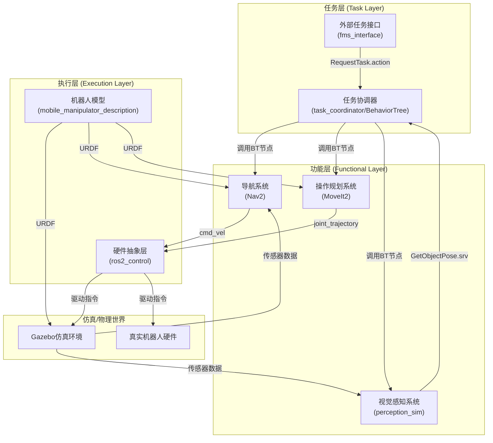

# 系统架构设计

本文档定义了 `ros2_foundry` 项目的系统架构和核心模块间的通信方式。

## 架构图 (Mermaid.js)

## 模块说明

- **ros2_foundry_description**: 包含机器人的URDF/xacro模型，定义了连杆、关节、传感器和`ros2_control`接口。
- **ros2_foundry_gazebo**: 包含Gazebo的World文件和启动配置，负责创建仿真世界。
- **ros2_foundry_navigation**: 包含Nav2的配置文件和地图，负责机器人的自主导航。
- **ros2_foundry_moveit_config**: 包含MoveIt2的配置文件，由Setup Assistant生成，负责机械臂的运动规划。
- **ros2_foundry_perception**: 包含视觉感知算法，负责从传感器数据中识别物体并发布其位姿。
- **ros2_foundry_interfaces**: 定义项目中所有自定义的 `.msg`, `.srv`, `.action` 文件。
- **ros2_foundry_bt_nodes**: 包含所有自定义的行为树节点，作为连接ROS2 Action/Service和行为树的桥梁。
- **ros2_foundry_bringup**: 顶层包，包含项目的主行为树(XML)和总启动文件，负责编排所有模块以完成复杂任务。
